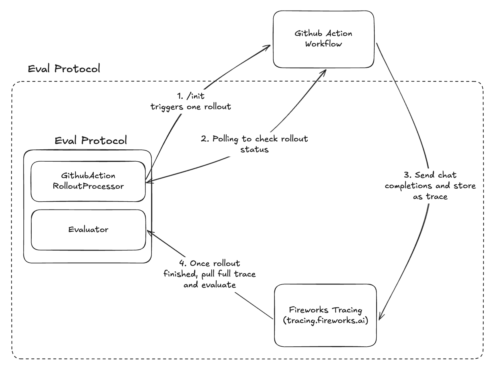
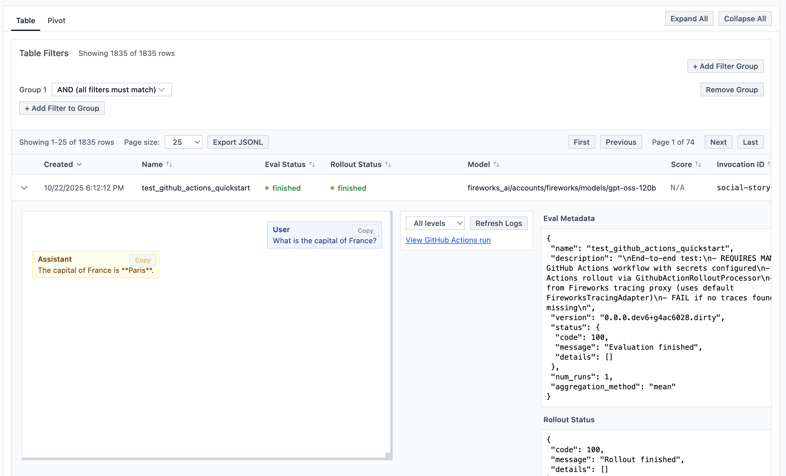

<h1 align="center">GitHub Action Rollout Processor Hello World</h1>

<p align="center">
  
</p>

<p align="center">
    Run distributed LLM evaluations using GitHub Actions as your rollout processor with automatic trace collection. Scale your evaluations in the cloud without managing infrastructure.
</p>

> **📖 New to GitHub Action Rollout Processing?** Read the complete [GitHub Actions Rollout Tutorial](https://evalprotocol.io/tutorial/github-actions-rollout) first - this repository serves as the working example for that tutorial.

<br/>

## Quick Start

### Repository Setup

1. **Fork or clone this repository**
   ```
   git clone https://github.com/eval-protocol/github-action-rollout-processor-hello-world.git
   ```

2. **Set up [secrets](https://docs.github.com/en/actions/how-tos/write-workflows/choose-what-workflows-do/use-secrets#creating-secrets-for-a-repository)** in your repo:
   ```
   FIREWORKS_API_KEY="your_fireworks_key"
   ```
3. **Set up your local environment**:
   
   For the GitHub token, create a [Personal Access Token (classic)](https://docs.github.com/en/authentication/keeping-your-account-and-data-secure/managing-your-personal-access-tokens#personal-access-tokens-classic) with permissions for `repo` and `workflow`.
   
   ```bash
   export GITHUB_TOKEN="ghp_..."
   export FIREWORKS_API_KEY="your_fireworks_key"
   ```

### Installation

```bash
pip install eval-protocol
```

## Running the Example

```bash
pytest quickstart.py -vs
```

### What's Happening

1. **/init triggers one rollout**: Eval Protocol dispatches a GitHub Actions workflow with `completion_params`, `metadata` (incl. `rollout_id`), and `model_base_url`.
2. **Polling to check rollout status**: The processor finds the `rollout:<rollout_id>` run and polls GitHub Actions until it completes.
3. **Send chat completions and store as trace**: The workflow executes your agent and sends completions/logs to Fireworks with the rollout’s correlation tags.
4. **Once rollout finished, pull full trace and evaluate**: Eval Protocol fetches the Fireworks trace by `rollout_id` and scores the result.

> **Example**: See a [successful rollout execution](https://github.com/eval-protocol/github-action-rollout-processor-hello-world/actions/runs/18734437289) to understand what the GitHub Actions workflow looks like in practice.

### Viewing Results

After running the test, start the local UI server to view results:

```bash
ep logs
```

Visit `http://localhost:8000` to explore your evaluation results with detailed traces and metrics.

<p align="center">
  
</p>

## Learn More

- [Eval Protocol Documentation](https://evalprotocol.io/introduction)
- [GitHub Actions Documentation](https://docs.github.com/en/actions)
- [Fireworks AI Platform](https://fireworks.ai)
- [GitHub Actions Rollout Tutorial](https://evalprotocol.io/tutorial/github-actions-rollout)
